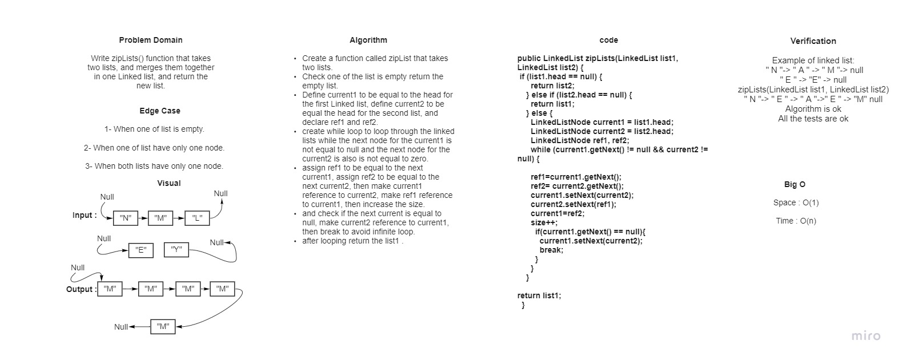

# 5.Singly Linked List

Singly linked lists contain nodes which have a data field as well as 'next' field, which points to the next node in line of nodes.

## Challenge And API

## Challenge

1. A Node class that has properties for the value stored in the Node, and a pointer to the next Node.
2. LinkedLink Class, that contains:

- A head property.
- Insert method -> Adds a new node In the beginning of the LinkedList.
- Includes method -> Indicates whether that value exists as a Node’s value somewhere within the list.
- to string -> Returns: a string representing all the values in the Linked List, formatted as:
  "{ a } -> { b } -> { c } -> NULL"

## Approach & Efficiency :
- I used while loops in each method which takes space : O(1) and time: O(n)

## Challenge7 Summary:

## zipLists which accepts to linkedLists and merge them to one linkedList.

## WhiteBoard Process :

<<<<<<< HEAD

=======

.jpg)

>>>>>>> linked-list-insertions

## Approach & Efficiency :

## I used if statements and while loop to solve this code challenge.

