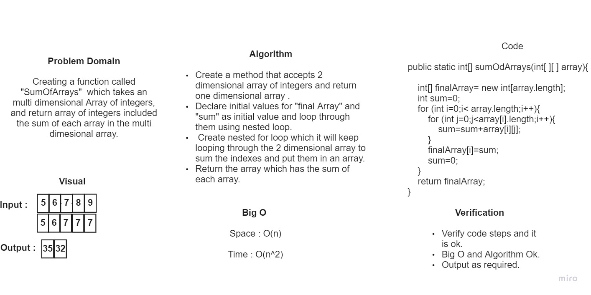

## add the numbers in the 2 dimensional array  :

## Adding the numbers in 2 dimensional array and return one dimensional array.

## WhiteBoard Process : 

## Approach & Efficiency : 

# I used nested for loop to solve this challenge.