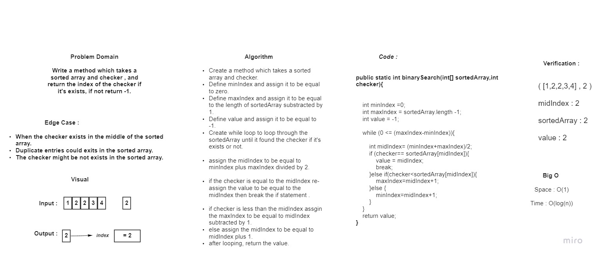

# Binary Search of Sorted Array

## The function will check if the number in exists in the array it will return the index for this number if the number is not exist it function will give you -1 .

## WhiteBoard Process :

## Approach & Efficiency :

# I used while  loop and if else statements to solve this challenge.