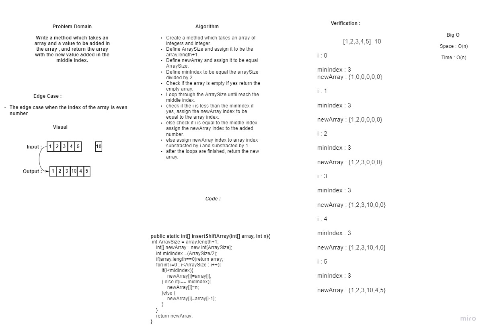

## Insert to Middle of an Array : 

## Having an array and number as an argument and add the number inside the middle of the array.

## WhiteBoard Process : 

## Approach & Efficiency : 

# I used for loop and if else statements to solve this challenge.