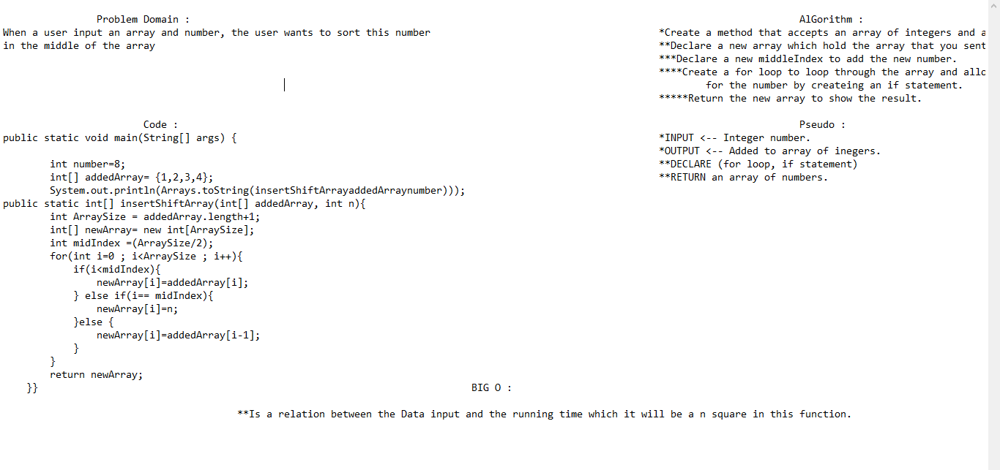

## Insert to Middle of an Array : 

## Having an array with a specific index, the challenging part that I have to reverse the array which the last index will be the first and the first one should be the last index.

## WhiteBoard Process : 

## Approach & Efficiency : 

# I used the for loop to return an reversed array.